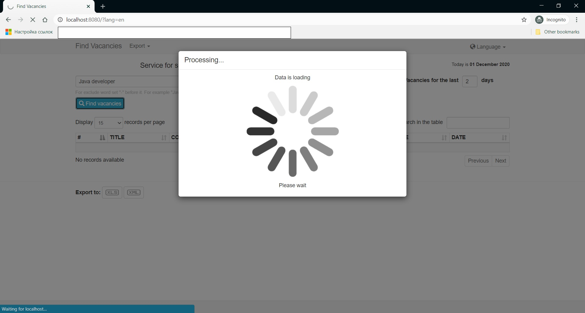

# FindVacancies
Build status:  

Web application for the selection of job vacancies from most popular sites:
- [Head hunter](http://hh.ua)
- [work.ua](http://work.ua)
- [rabota.ua](http://rabota.ua)
- [DOU.ua](http://DOU.ua)

To search, you must select one or more sites, set the last days period and enter keywords.
If necessary, some results can be excluded for some words. Just put the ** "-" ** in front of them. For example, to exclude junior positions for vacancies for "java developer", keywords line will be "java developer -junior".

Results table can be exporting to **XML** or **XLS** files.

[Visit site](https://findvacancies.herokuapp.com/)

#### Screenshot with example

### **For work needs:**
- IDE
- JDK 11 or later
- Maven

### **Current version:**
Release 2.0

### **Release notes:**
**Version Release 2.0:** Spring MVC replacing with Spring Boot, add Java Configuration, add JUnit 5
**Version Release 1.1:** Spring MVC app with XML Configuration, JSP, Bootstrap 3, JUnit 4

