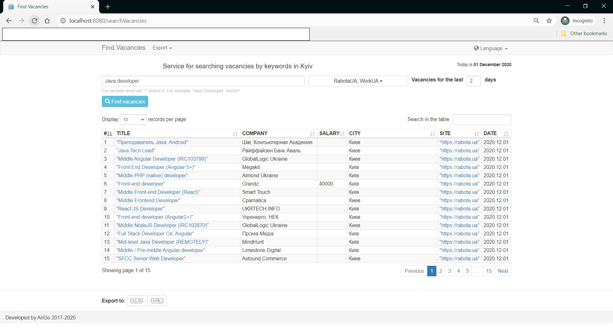

# FindVacancies
Build status: 

Web application for the selection of job vacancies from most popular sites:
- [Head hunter](http://hh.ua)
- [work.ua](http://work.ua)
- [rabota.ua](http://rabota.ua)
- [DOU.ua](http://DOU.ua)

To search, you must select one or more sites, set the last days period and enter keywords.
If necessary, some results may be excluded for some words. Just put the ** "-" ** in front of them. For example, to exclude senior positions for vacancies for "java developer", keywords line will be "java developer -senior".

Results table can be exporting to **XML** or **XLS** files.

[Visit site](https://findvacancies.herokuapp.com/)

#### Screenshot with example

## **For work need:**
- IDE
- JDK 1.8 or later
- Maven
- Tomcat

