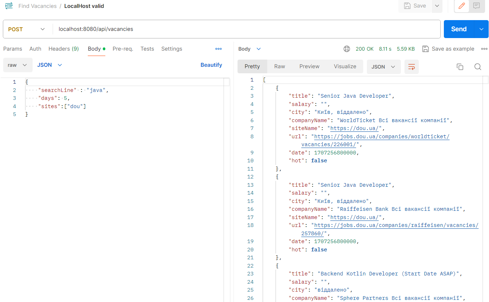
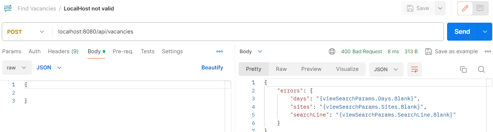
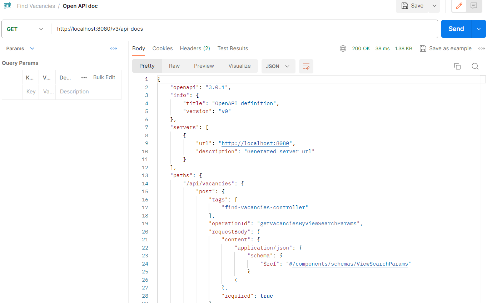

# FindVacancies

Web application based on Spring Boot Web Flux for searching for vacancies from popular sites:
- [work.ua](https://www.work.ua/)
- [DOU.ua](https://dou.ua/)
- [grc.ua](https://grc.ua/)
- [djinni.co](https://djinni.co/)

To search, you must set one or more sites, set the last days period and enter keywords.
If necessary, some results can be excluded for some words. Just put the ** "-" ** in front of them. For example, to exclude junior positions for vacancies for "java developer", keywords line will be "java developer -junior".

<details><summary><b>Screenshot with example:</b></summary>

|  |
|:-------------------------------------------------:|
|                *Page with results*                |


|  |
|:-------------------------------------------------:|
|                *Validation errors*                |
</details>

### Technology stack:
- Framework: Spring boot 3
- Build: Maven
- Containers: Docker, Docker-compose
- Swagger: springdoc-openapi
- Utils: Actuator

### Run and check
Run Spring boot project. 

Open Swagger with url:```http://localhost:8080/webjars/swagger-ui/index.html```

<details><summary><b>Swagger page example:</b></summary>

|  |
|:------------------------------------------:|
|           *Swagger page example*           |
</details>

Open Api-Docs wit url: ```http://localhost:8080/v3/api-docs```

<details><summary><b>Api-doc example in Postman:</b></summary>

|  |
|:----------------------------------------------:|
|               *Api-doc example*                |
</details>


### **For work needs:**
- IDE
- JDK 17
- Maven


### **Create Docker build**
From project root:
```
docker build -f findvacancies-web-flux\Dockerfile -t fv-web-flux .
```

### **Current version:**
Release 2.3
