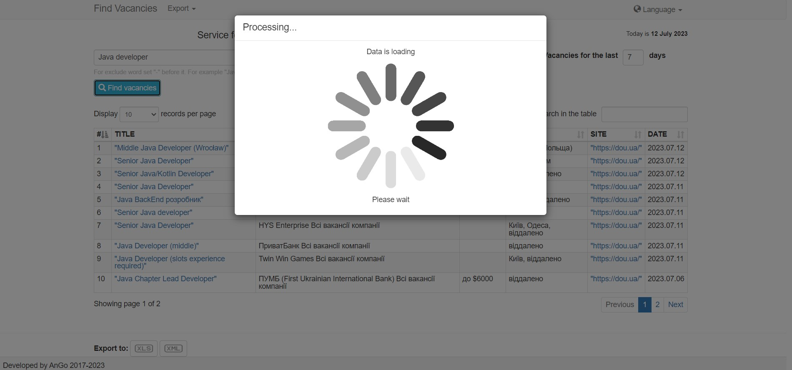
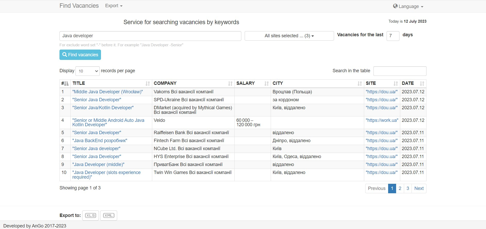
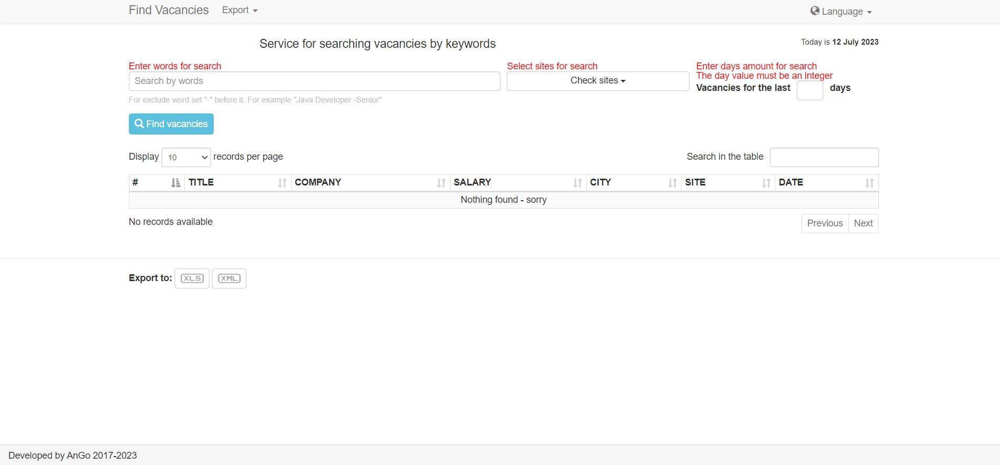

# FindVacancies

Web application based on Spring Boot with JSP for searching for vacancies from popular sites:
- [work.ua](https://www.work.ua/)
- [DOU.ua](https://dou.ua/)
- [grc.ua](https://grc.ua/)
- [djinni.co](https://djinni.co/)

To search, you must select one or more sites, set the last days period and enter keywords.
If necessary, some results can be excluded for some words. Just put the ** "-" ** in front of them. For example, to exclude junior positions for vacancies for "java developer", keywords line will be "java developer -junior".

Results table can be exporting to **XML** or **XLSX** files.

### Screenshot with example







### **For work needs:**
- IDE
- JDK 17
- Maven

If you are using IDEA development tools, then you can try specifying
```
Configurations -> Configuration -> environment -> Working directory
```
The value in $MODULE_DIR$ or $MODULE_WORKING_DIR$

### **Create Docker build**
From project root:
```
docker build -f findvacancies-web-jsp\Dockerfile -t fv-jsp .
```

### **Current version:**
Release 2.3

### **Release notes:**
**Version Release 2.3:** Switch to Spring Boot 3
**Version Release 2.1:** Switch to Java 17, separate on modules
**Version Release 2.0:** Spring MVC replacing with Spring Boot, add Java Configuration, add JUnit 5
**Version Release 1.1:** Spring MVC app with XML Configuration, JSP, Bootstrap 3, JUnit 4
