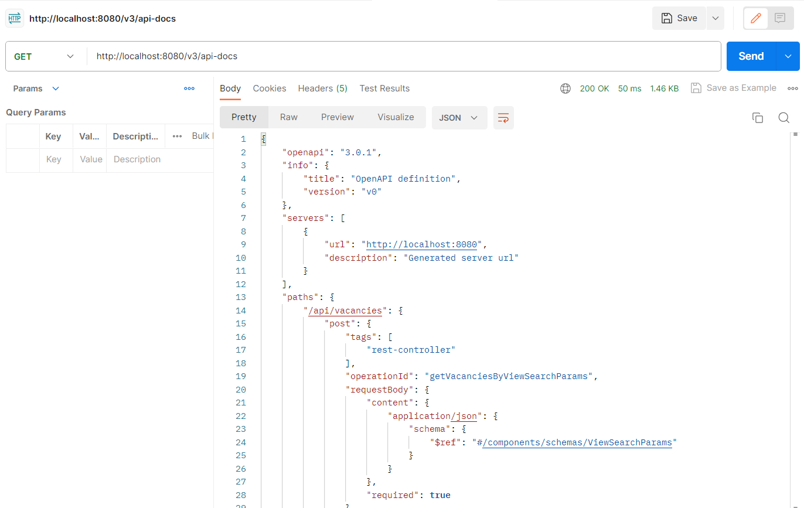

# FindVacancies

Web application based on Spring Boot REST for searching for vacancies from popular sites:
- [work.ua](https://www.work.ua/)
- [DOU.ua](https://dou.ua/)
- [grc.ua](https://grc.ua/)

To search, you must set one or more sites, set the last days period and enter keywords.
If necessary, some results can be excluded for some words. Just put the ** "-" ** in front of them. For example, to exclude junior positions for vacancies for "java developer", keywords line will be "java developer -junior".

### Screenshot with example


### Run and check
Run Spring boot project. Open browser with url:
```http://localhost:8080/swagger-ui/index.html```

You can see:


Open 
```http://localhost:8080/v3/api-docs```

 you will see document in Json format:

You can see:



### **For work needs:**
- IDE
- JDK 17
- Maven

### **Current version:**
Release 2.3
