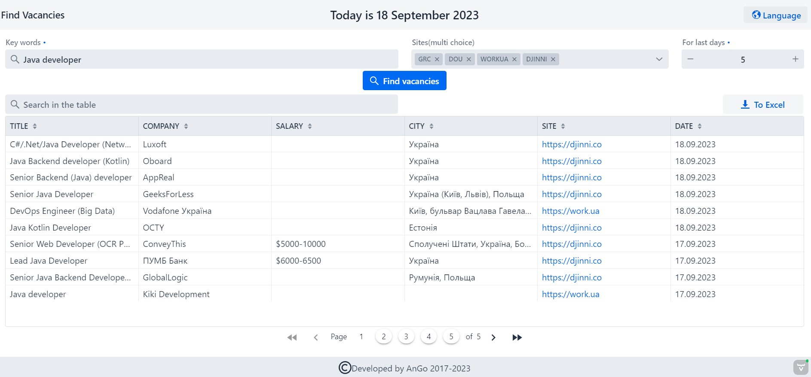
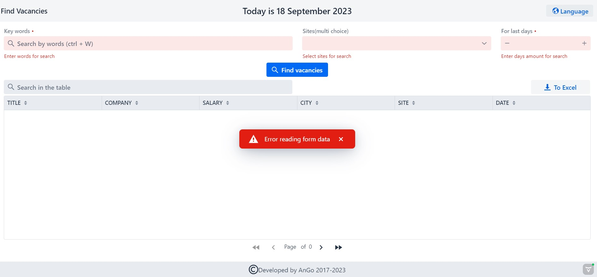

# FindVacancies

Web application based on Spring Boot with Vaadin for searching for vacancies from popular sites:
- [work.ua](https://www.work.ua/)
- [DOU.ua](https://dou.ua/)
- [grc.ua](https://grc.ua/)
- [djinni.co](https://djinni.co/)

To search, you must select one or more sites, set the last days period and enter keywords.
If necessary, some results can be excluded for some words. Just put the ** "-" ** in front of them. For example, to exclude junior positions for vacancies for "java developer", keywords line will be "java developer -junior".

Results table can be exporting to **XLSX** files.

<details><summary><b>Screenshot with example:</b></summary>

|  | 
|:------------------------------------------------:|
|               *Page with results*                |

|  | 
|:-------------------------------------------------:|
|                *Validation errors*                |
</details>

### Technology stack:
- Framework: Spring boot 3
- Build: Maven
- Containers: Docker, Docker-compose
- Front: vaadin
- Utils: Actuator

### **For work needs:**
- IDE
- JDK 17
- Maven

### **Current version:**
Release 2.3

### **Create Docker build**
From project root:
```
docker build -f findvacancies-web-vaadin\Dockerfile -t fv-vaadin .
```

### **Release notes:**
**Version Release 2.3:** Switch to Spring Boot 3 and Vaadin 24
**Version Release 2.2:** Spring boot 2 app with Vaadin 23
